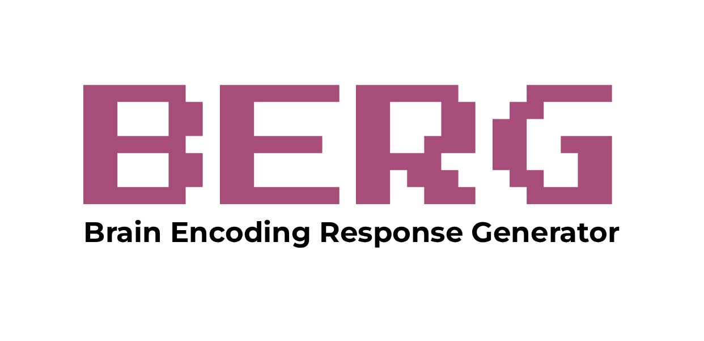

The [**Brain Encoding Response Generator (BERG)**][website] is a resource consisting of multiple pre-trained encoding models of the brain and an accompanying Python package to generate accurate in silico neural responses to arbitrary stimuli with just a few lines of code.

In silico neural responses from encoding models increasingly resemble in vivo responses recorded from real brains, enabling the novel research paradigm of in silico neuroscience. In silico neural responses are quick and cheap to generate, allowing researchers to explore and test scientific hypotheses across vastly larger solution spaces than possible in vivo. Novel findings from large-scale in silico experimentation are then validated through targeted small-scale in vivo data collection, in this way optimizing research resources. Thus, in silico neuroscience scales beyond what is possible with in vivo data, and democratizes research across groups with diverse data collection infrastructure and resources. To catalyze this emerging research paradigm, we introduce the Brain Encoding Response Generator (BERG), a resource consisting of multiple pre-trained encoding models of the brain and an accompanying Python package to generate accurate in silico neural responses to arbitrary stimuli with just a few lines of code. BERG includes a growing, well documented library of encoding models trained on different neural data acquisition modalities, datasets, subjects, stimulation types, and brain areas, offering broad versatility for addressing a wide range of research questions through in silico neuroscience.

<font color='red'><b>Note:</b></font> Beyond BERG's native models, BERG is also integrated with [BrainScore](https://www.brain-score.org), giving you access to hundreds of vision models scored against macaque neural recordings (V1, V2, V4, IT), as well as GPT-family language models scored against human fMRI data.

For additional information on BERG, you can check out our [website][website], [paper][paper], and [documentation][documentation].


## 🤝 Contribute to Expanding BERG

We warmly welcome contributions to improve and expand BERG, including:
- Encoding models with higher prediction accuracies.
- Encoding models for new neural data recording modalities (e.g., MEG/ECoG/animal).
- Encoiding models from new neural dataset.
- Encoding models of neural responses for new stimulus types (e.g., videos, audio, language, multimodal).
- Suggestions to improve BERG.

For more information on how to contribute, please refer to [our documentation][berg_contribute]. If you have questions or would like to discuss your contribution before submitting, you can contact us at brain.berg.info@gmail.com. All feedback and help is strongly appreciated!


## ⚙️ Installation

> **Requires Python ≥ 3.11**

#### Recommended (includes TRIBEv2)

```shell
pip install -U "berg[full] @ git+https://github.com/gifale95/BERG.git"
```

#### BrainScore (optional, replaces TRIBEv2)

BERG is integrated with [BrainScore](https://www.brain-score.org), giving you access to hundreds of vision models scored against macaque neural recordings (V1, V2, V4, IT), as well as GPT-family language models scored against human fMRI data.

```shell
pip install -U "berg[brainscore] @ git+https://github.com/gifale95/BERG.git"
```

> **Note:** TRIBEv2 and BrainScore cannot be installed together due to a NumPy version conflict. Choose one depending on your use case. BrainScore requires Python = 3.11 specifically.


## 🕹️ How to use

### 🧰 Download the Brain Encoding Response Generator


BERG is hosted as a public [AWS S3 bucket](https://brain-encoding-response-generator.s3.us-west-2.amazonaws.com/index.html) via the AWS Open Data Program. You do **not need an AWS account** to browse or download the data.

<font color='red'><b>IMPORTANT:</b></font> By downloading the data you agree to BERG's [Terms and Conditions](https://brain-encoding-response-generator.readthedocs.io/en/latest/about/terms_and_conditions.html).

To download the full BERG dataset into a local folder named `brain-encoding-response-generator`, use the AWS CLI:

```bash
aws s3 sync --no-sign-request s3://brain-encoding-response-generator ./brain-encoding-response-generator
```

You can also download specific subfolders, for example:

```bash
aws s3 sync --no-sign-request s3://brain-encoding-response-generator/encoding_models/modality-fmri ./modality-fmri
```

Or, you can also downlaod specific files:

```bash
aws s3 cp --no-sign-request s3://brain-encoding-response-generator/encoding_models/../model_weights.npy ./modality-fmri
```

For detailed instructions and folder structure, see the [documentation](https://brain-encoding-response-generator.readthedocs.io/en/latest/data_storage.html#).


### 🧠 Available encoding models

The following table shows BERG's most accurate encoding models for each dataset and modality. For more details on these models, or for the full list of available models, refer to the [documentation][model_cards].

| Model ID | Training dataset | Neural recoding modality | Species | Stimuli | Encoding accuracy |
|----------|------------------|--------------------|---------|---------|-------------------|
| [fmri-nsd_fsaverage-huze][fmri-nsd_fsaverage-huze] | [NSD (surface space)][allen] | fMRI | Human | Images | [Accuracy plots][acc-fmri-nsd_fsaverage-huze] |
| [fmri-nsd-fwrf][fmri-nsd-fwrf] | [NSD (volume space)][allen] | fMRI | Human | Images | [Accuracy plots][acc-fmri-nsd-fwrf] |
| [fmri-mosaic-CNN8_multihead_subAll_verticesVisual][fmri-mosaic-CNN8_multihead_subAll_verticesVisual] | [MOSAIC][MOSAIC] | fMRI | Human | Images | [Accuracy plots][acc-mosaic-CNN8_multihead_subAll_verticesVisual] |
| [fmri-mosaic-CNN8_multihead_subNSD_verticesAll][fmri-mosaic-CNN8_multihead_subNSD_verticesAll] | [MOSAIC][MOSAIC] | fMRI | Human | Images | [Accuracy plots][acc-mosaic-CNN8_multihead_subNSD_verticesAll] |
| [fmri-bmd-s3d][fmri-bmd-s3d] | [BMD][bmd] | fMRI | Human | Videos | [Accuracy plots][acc-fmri-bmd-s3d] |
| [fmri-things_fmri_1-vit_b_32][fmri-things_fmri_1-vit_b_32] | [THINGS fMRI1][things_data] | fMRI | Human | Images | [Accuracy plots][acc-fmri-things_fmri_1-vit_b_32] |
| [eeg-things_eeg_2-vit_b_32][eeg-things_eeg_2-vit_b_32] | [THINGS EEG2][THINGS EEG2] | EEG | Human | Images | [Accuracy plots][acc-eeg-things_eeg_2-vit_b_32] |
| [meg-things_meg_1-vit_b_32][meg-things_meg_1-vit_b_32] | [THINGS MEG1][things_data] | MEG | Human | Images | [Accuracy plots][acc-meg-things_meg_1-vit_b_32] |
| [utah_array-tvsd-vit_b_32][utah_array-tvsd-vit_b_32] | [TVSD][tvsd] | Utah arrays | Macaque | Images | [Accuracy plots][acc-utah_array-tvsd-vit_b_32] |
| [calcium_2p-wang_2025-3DCNN][calcium_2p-wang_2025-3DCNN] | [Wang et al., 2025][wang_2025] | two-photon calcium imaging | Mouse | Videos | [Accuracy plots][acc-calcium_2p-wang_2025-3DCNN] |
| [fmri-tuckute_2024-GPT2_XL][fmri-tuckute_2024-GPT2_XL] | [Tuckute et al., 2024][tuckute_2024] | fMRI | Human | Text | [Accuracy plots][acc-fmri-tuckute_2024-GPT2_XL] |
| [fmri-cneuromod_algo2025-text2fmri][fmri-cneuromod_algo2025-text2fmri] | [CNeuroMod/Algonauts2025][Algonauts] | fMRI | Human | Text | [HF Collection][acc-fmri-cneuromod_algo2025-text2fmri] |
| [fmri-cneuromod_algo2025-vibe][fmri-cneuromod_algo2025-vibe] | [CNeuroMod/Algonauts2025][Algonauts] | fMRI | Human | Video + Audio + Text | [Accuracy plots][acc-fmri-cneuromod_algo2025-vibe] |
| [brainscore_language][brainscore_language] | [Pereira et al., 2018][pereira_2018] | fMRI | Human | Text | [BrainScore leaderboard (language)][bs_leaderboard_language] |
| [brainscore_vision][brainscore_vision] | [Freeman et al., 2013][freeman_2013]; [Majaj et al., 2015][majaj_2015] | Ephys | Macaque | Images | [BrainScore leaderboard (vision)][bs_leaderboard_vision] |
| [fmri-multi_study-tribe_v2][fmri-multi_study-tribe_v2] | [Multi-study naturalistic fMRI][tribev2] | fMRI | Human | Video + Audio + Text | [TRIBE v2 paper][acc-fmri-multi_study-tribe_v2] |
| [ecog-zada2025-gpt2_xl][ecog-zada2025-gpt2_xl] | [Zada et al., 2025][zada_2025] | ECoG | Human | Text | [Accuracy plots][acc-ecog-zada2025-gpt2_xl] |
| [fmri-lebel2023-opt_1_3b][fmri-lebel2023-opt_1_3b] | [LeBel et al., 2023][lebel_2023] | fMRI | Human | Text | [Accuracy plots][acc-fmri-lebel2023-opt_1_3b] |

### ✨ BERG functions

#### 🔹 Initialize the BERG object

To use `BERG`'s functions, you first need to import `BERG` and create a `berg_object`.

```python
from berg import BERG

# Initialize BERG with the path to the toolkit
berg = BERG(berg_dir="path/to/brain-encoding-response-generator")
```
#### 🔹 Generate in silico neural responses to stimuli

Step 1: Load an encoding model of your choice using the `get_encoding_model` function.

```python
# Load an example fMRI encoding model
fmri_model = berg.get_encoding_model("fmri-nsd_fsaverage-huze", 
                                     subject=1,
                                     device="cpu")

# Load an example EEG encoding model
eeg_model = berg.get_encoding_model("eeg-things_eeg_2-vit_b_32",
                                    subject=1,
                                    device="auto")

```

Step 2: Generate in silico neural responses to stimuli using the `encode` function.

```python
# Encode fMRI responses to images with metadata
insilico_fmri, insilico_fmri_metadata = berg.encode(fmri_model,
                                                    images,
                                                    return_metadata=True)  # if needed

# Encode EEG responses to images without metadata
insilico_eeg = berg.encode(eeg_model,
                           images)
```

#### 🔹 Get the models' metadata

You can also load the encoding models' metadata without having to load the models themselves.

```python
# Load the encoding models' metadata
metadata = berg.get_model_metadata("fmri-nsd_fsaverage-huze",
                                   subject=1)
```

For more detailed information on how to use these functions, which parameters are available, and the content of the model metadata files, refer to the [model cards in the documentation][model_cards], or to the **Tutorials** below ⬇️.


### 💻 Tutorials

We provide several tutorials to help you get started with BERG (you can run these tutorials on Colab or locally as Jupyter Notebooks):

**Using BERG:**
- [Quickstart Tutorial](https://drive.google.com/file/d/1JS4um1eS4Ml983lUNQgEw4544_Lc5Qn0/view?usp=drive_link) - Quick Guide on how to generate in silico neural responses
- [fMRI Tutorial](https://drive.google.com/file/d/1w4opmM9h8Oe1NWlwIDuLuDIGuIXj9UaV/view?usp=drive_link) - Learn how to generate in silico fMRI responses.
- [EEG Tutorial](https://drive.google.com/file/d/1uF5nr1pyg0_my3gULj3w5y0nuq5gZjhL/view?usp=drive_link) - Learn how to generate in silico EEG responses.
- [BrainScore Tutorial](https://colab.research.google.com/drive/1B-gRZmdN6ZhxUUgUXgxfTgJc344a8Z17) - Learn how to generate in silico neural responses using BrainScore vision and language models.
- [Adding New Models](https://drive.google.com/file/d/1nBxEiJATzJdWwfzRPmyai2G76HkeBhAU/view?usp=drive_link) - Guide on how to contribute your own encoding models to BERG.

**Example Application - Relational Neural Control (RNC):**

We used BERG to develop [Relational Neural Control](https://github.com/gifale95/RNC), a neural control algorithm to move from an atomistic understanding of visual cortical areas (i.e., What does each area represent?) to a network-level understanding (i.e., What is the relationship between representations in different areas?). Through RNC we discovered controlling images that align or disentangle responses across areas, thus indicating their shared or unique representational content. Closing the empirical cycle, we validated the in silico discoveries on in vivo fMRI responses from independent subjects. Following are RNC tutorials based on in silico fMRI responses generated through BERG:

- [Univariate RNC Tutorial](https://colab.research.google.com/drive/1QpMSlvKZMLrDNeESdch6AlQ3qKsM1isO?usp=sharing) 
- [Multivariate RNC Tutorial](https://colab.research.google.com/drive/1bEKCzkjNfM-jzxRj-JX2zxB17XBouw23?usp=sharing) 


## 📦 BERG creation code

The folder [`../BERG/berg_creation_code/`][berg_creation_code] contains the code used to train the encoding models in BERG, divided in the following sub-folders:

* **[`../01_prepare_data/`][prepare_data]:** prepare the neural responses in the right format for encoding model training.
* **[`../02_train_encoding_models/`][train_encoding]:** train the encoding models, and save their weights.
* **[`../03_test_encoding_models/`][test_encoding]:** test the encoding models (i.e., compute and plot their encoding accuracy).


## ❗ Issues

If you come across problems with this Python package, please submit an issue!


## 📜 Citation

If you use BERG, please cite:

> *Gifford AT, Bersch D, Janini D, Roig G, Cichy RM. 2025. The Brain Encoding Response Generator. In preparation. https://github.com/gifale95/BERG*


[website]: https://gifale95.github.io/BERG/
[paper]: https://2025.ccneuro.org/poster/?id=dIxr3CPuPR
[documentation]: https://brain-encoding-response-generator.readthedocs.io/en/latest/
[berg_structure]: https://brain-encoding-response-generator.readthedocs.io/en/latest/data_storage.html#
[model_cards]: https://brain-encoding-response-generator.readthedocs.io/en/latest/models/overview.html
[berg_contribute]: https://brain-encoding-response-generator.readthedocs.io/en/latest/contribution.html
[nsd]: https://naturalscenesdataset.org/
[allen]: https://www.nature.com/articles/s41593-021-00962-x
[requirements]: https://github.com/gifale95/BERG/blob/main/requirements.txt
[rclone]: https://rclone.org/
[guide]: https://noisyneuron.github.io/nyu-hpc/transfer.html
[THINGS EEG2]: https://doi.org/10.1016/j.neuroimage.2022.119754
[things_data]: https://doi.org/10.7554/eLife.82580
[bmd]: https://doi.org/10.1038/s41467-024-50310-3
[tvsd]: https://doi.org/10.1016/j.neuron.2024.12.003
[wang_2025]: https://doi.org/10.1038/s41586-025-08829-y

[get_encoding_model]: https://github.com/gifale95/BERG/blob/main/berg/berg.py#L207
[encode]: https://github.com/gifale95/BERG/blob/main/berg/berg.py#L321
[load_insilico_neural_responses]: https://github.com/gifale95/BERG/blob/main/berg/berg.py#L551

[fmri-nsd_fsaverage-huze]: https://brain-encoding-response-generator.readthedocs.io/en/latest/models/model_cards/fmri-nsd_fsaverage-huze.html
[fmri-nsd_fsaverage-vit_b_32]: https://brain-encoding-response-generator.readthedocs.io/en/latest/models/model_cards/fmri-nsd_fsaverage-vit_b_32.html
[fmri-things_fmri_1-vit_b_32]: https://brain-encoding-response-generator.readthedocs.io/en/latest/models/model_cards/fmri-things_fmri_1-vit_b_32.html
[fmri-bmd-s3d]: https://brain-encoding-response-generator.readthedocs.io/en/latest/models/model_cards/fmri-bmd-s3d.html
[meg-things_meg_1-vit_b_32]: https://brain-encoding-response-generator.readthedocs.io/en/latest/models/model_cards/meg-things_meg_1-vit_b_32.html
[utah_array-tvsd-vit_b_32]: https://brain-encoding-response-generator.readthedocs.io/en/latest/models/model_cards/utah_array-tvsd-vit_b_32.html
[fmri-nsd-fwrf]: https://brain-encoding-response-generator.readthedocs.io/en/latest/models/model_cards/fmri-nsd-fwrf.html
[eeg-things_eeg_2-vit_b_32]: https://brain-encoding-response-generator.readthedocs.io/en/latest/models/model_cards/eeg-things_eeg_2-vit_b_32.html
[calcium_2p-wang_2025-3DCNN]: https://brain-encoding-response-generator.readthedocs.io/en/latest/models/model_cards/calcium_2p-wang_2025-3DCNN.html


[fmri_tutorial_colab]: https://colab.research.google.com/drive/1W9Sroz2Y0eTYfyhVrAJwe50GGHHAGBdE?usp=drive_link
[eeg_tutorial_colab]: https://colab.research.google.com/drive/10NSRBrJ390vuaPyRWq5fDBIA4NNAUlTk?usp=drive_link
[fmri_tutorial_jupyter]: https://github.com/gifale95/BERG/blob/main/tutorials/berg_fmri_tutorial.ipynb
[eeg_tutorial_jupyter]: https://github.com/gifale95/BERG/blob/main/tutorials/berg_eeg_tutorial.ipynb
[uni_rnc_colab]: https://colab.research.google.com/drive/1QpMSlvKZMLrDNeESdch6AlQ3qKsM1isO?usp=sharing
[multi_rnc_colab]: https://colab.research.google.com/drive/1bEKCzkjNfM-jzxRj-JX2zxB17XBouw23?usp=sharing
[uni_rnc_jupyter]: https://github.com/gifale95/RNC/blob/main/tutorials/univariate_rnc_tutorial.ipynb
[multi_rnc_jupyter]: https://github.com/gifale95/RNC/blob/main/tutorials/multivariate_rnc_tutorial.ipynb
[berg_creation_code]: https://github.com/gifale95/BERG/tree/main/berg_creation_code/
[prepare_data]: https://github.com/gifale95/BERG/tree/main/berg_creation_code/01_prepare_data
[train_encoding]: https://github.com/gifale95/BERG/tree/main/berg_creation_code/02_train_encoding_models
[test_encoding]: https://github.com/gifale95/BERG/tree/main/berg_creation_code/03_test_encoding_models
[metadata]: https://github.com/gifale95/BERG/tree/main/berg_creation_code/03_create_metadata
[synthesize]: https://github.com/gifale95/BERG/tree/main/berg_creation_code/04_synthesize_neural_responses


[acc-eeg-things_eeg_2-vit_b_32]: https://brain-encoding-response-generator.s3.us-west-2.amazonaws.com/index.html#encoding_models/modality-eeg/train_dataset-things_eeg_2/model-vit_b_32/encoding_models_accuracy/
[acc-fmri-nsd-fwrf]: https://brain-encoding-response-generator.s3.us-west-2.amazonaws.com/index.html#encoding_models/modality-fmri/train_dataset-nsd/model-fwrf/encoding_models_accuracy/
[acc-fmri-nsd_fsaverage-huze]: https://brain-encoding-response-generator.s3.us-west-2.amazonaws.com/index.html#encoding_models/modality-fmri/train_dataset-nsd_fsaverage/model-huze/encoding_models_accuracy/
[acc-utah_array-tvsd-vit_b_32]: https://brain-encoding-response-generator.s3.us-west-2.amazonaws.com/index.html#encoding_models/modality-utah_array/train_dataset-tvsd/model-vit_b_32/encoding_models_accuracy/
[acc-meg-things_meg_1-vit_b_32]: https://brain-encoding-response-generator.s3.us-west-2.amazonaws.com/index.html#encoding_models/modality-meg/train_dataset-things_meg_1/model-vit_b_32/encoding_models_accuracy/
[acc-fmri-things_fmri_1-vit_b_32]: https://brain-encoding-response-generator.s3.us-west-2.amazonaws.com/index.html#encoding_models/modality-fmri/train_dataset-things_fmri_1/model-vit_b_32/encoding_models_accuracy/
[acc-fmri-bmd-s3d]: https://brain-encoding-response-generator.s3.us-west-2.amazonaws.com/index.html#encoding_models/modality-fmri/train_dataset-bmd/model-s3d/encoding_models_accuracy/

[MOSAIC]: https://www.biorxiv.org/content/10.64898/2025.11.28.690060v1
[fmri-mosaic-CNN8_multihead_subNSD_verticesAll]: https://brain-encoding-response-generator.readthedocs.io/en/latest/models/model_cards/fmri-mosaic-CNN8_multihead_subNSD_verticesAll.html
[fmri-mosaic-CNN8_multihead_subAll_verticesVisual]: https://brain-encoding-response-generator.readthedocs.io/en/latest/models/model_cards/fmri-mosaic-CNN8_multihead_subAll_verticesVisual.html
[acc-mosaic-CNN8_multihead_subNSD_verticesAll]: https://brain-encoding-response-generator.s3.us-west-2.amazonaws.com/index.html#encoding_models/modality-fmri/train_dataset-mosaic/model-CNN8_multihead_subNSD_verticesAll/encoding_models_accuracy/
[acc-mosaic-CNN8_multihead_subAll_verticesVisual]: https://brain-encoding-response-generator.s3.us-west-2.amazonaws.com/index.html#encoding_models/modality-fmri/train_dataset-mosaic/model-CNN8_multihead_subAll_verticesVisual/encoding_models_accuracy/
[acc-mosaic-CNN8_multihead_subAll_verticesVisual]: https://brain-encoding-response-generator.s3.us-west-2.amazonaws.com/index.html#encoding_models/modality-fmri/train_dataset-mosaic/model-CNN8_multihead_subAll_verticesVisual/encoding_models_accuracy/
[acc-calcium_2p-wang_2025-3DCNN]: https://brain-encoding-response-generator.s3.us-west-2.amazonaws.com/index.html#encoding_models/modality-calcium_2p/train_dataset-wang_2025/model-3DCNN/encoding_models_accuracy/

[fmri-tuckute_2024-GPT2_XL]: https://brain-encoding-response-generator.readthedocs.io/en/latest/models/model_cards/fmri-tuckute_2024-GPT2_XL.html
[tuckute_2024]: https://www.nature.com/articles/s41562-023-01783-7
[acc-fmri-tuckute_2024-GPT2_XL]: https://brain-encoding-response-generator.s3.us-west-2.amazonaws.com/index.html#encoding_models/modality-fmri/train_dataset-tuckute_2024/model-GPT2_XL/encoding_models_accuracy/

[fmri-cneuromod_algo2025-text2fmri]: https://brain-encoding-response-generator.readthedocs.io/en/latest/models/model_cards/fmri-cneuromod_algo2025-text2fmri.html
[Algonauts]: https://algonautsproject.com/2025/index.html
[acc-fmri-cneuromod_algo2025-text2fmri]: https://huggingface.co/collections/ShreyDixit/text2fmri
[fmri-cneuromod_algo2025-vibe]: https://brain-encoding-response-generator.readthedocs.io/en/latest/model_cards/fmri-cneuromod_algo2025-vibe.html
[acc-fmri-cneuromod_algo2025-vibe]: https://brain-encoding-response-generator.s3.us-west-2.amazonaws.com/index.html#encoding_models/modality-fmri/train_dataset-cneuromod_algo2025/model-vibe/encoding_models_accuracy

[brainscore_language]: https://brain-encoding-response-generator.readthedocs.io/en/latest/models/model_cards/brainscore_language.html
[brainscore_vision]: https://brain-encoding-response-generator.readthedocs.io/en/latest/models/model_cards/brainscore_vision.html
[bs_leaderboard_vision]: https://www.brain-score.org/vision/leaderboard/
[bs_leaderboard_language]: https://www.brain-score.org/language/leaderboard/
[pereira_2018]: https://doi.org/10.1038/s41467-018-03068-4
[freeman_2013]: https://doi.org/10.1038/nn.3402
[majaj_2015]: https://doi.org/10.1152/jn.00262.2014

[fmri-multi_study-tribe_v2]: https://brain-encoding-response-generator.readthedocs.io/en/latest/models/model_cards/fmri-multi_study-tribe_v2.html
[tribev2]: https://github.com/facebookresearch/tribev2
[acc-fmri-multi_study-tribe_v2]: https://ai.meta.com/research/publications/a-foundation-model-of-vision-audition-and-language-for-in-silico-neuroscience/

[ecog-zada2025-gpt2_xl]: https://brain-encoding-response-generator.readthedocs.io/en/latest/models/model_cards/ecog-zada2025-gpt2_xl.md
[zada_2025]: https://doi.org/10.1038/s41597-025-05462-2
[acc-ecog-zada2025-gpt2_xl]: https://brain-encoding-response-generator.s3.us-west-2.amazonaws.com/index.html#encoding_models/modality-ecog/train_dataset-zada2025/model-gpt2_xl/encoding_models_accuracy/
[fmri-lebel2023-opt_1_3b]: https://gifale95.github.io/BERG/model_cards/fmri-lebel2023-opt_1_3b.html
[lebel_2023]: https://doi.org/10.1038/s41597-023-02437-z
[acc-fmri-lebel2023-opt_1_3b]: https://brain-encoding-response-generator.s3.us-west-2.amazonaws.com/index.html#encoding_models/modality-fmri/train_dataset-lebel2023/model-opt_1_3b_ridge/encoding_models_accuracy/